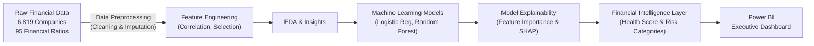

# 🏦 Financial Risk Intelligence & Bankruptcy Prediction Platform
### *An End-to-End Machine Learning & BI Project — Python • Power BI*


> A complete predictive analytics pipeline — from raw financial records to an interactive Power BI dashboard, uncovering **which financial ratios drive bankruptcy, and translating machine learning predictions into a 0-100 Financial Health Score and actionable Risk Categories for executive decision-making.**

---

## 📌 Table of Contents
- [Problem Statement](#-problem-statement)
- [Power BI Dashboard Preview](#-power-bi-dashboard-preview)
- [Project Architecture](#-project-architecture)
- [Tech Stack](#-tech-stack)
- [Dataset](#-dataset)
- [Project Workflow](#-project-workflow)
- [Key Business Insights](#-key-business-insights)
- [Repository Structure](#-repository-structure)
- [How to Reproduce This Project](#-how-to-reproduce-this-project)
- [Results & Recommendations](#-results--recommendations)

---

## 🎯 Problem Statement

* Banks and financial institutions face significant losses when loans are approved for companies that later become bankrupt.
* Traditional manual financial analysis is time-consuming and inconsistent.

This project develops a **Machine Learning model** to predict bankruptcy risk using financial ratios. It helps financial institutions identify high-risk companies before loan approval, supporting faster, more consistent, and data-driven credit decisions. The business success metric is to **detect maximum risky companies while minimizing financial loss**.

---

## 📊 Power BI Dashboard Preview

*(Executive Dashboard — Bankruptcy Risk Analysis • Financial Driver Analysis • Business Recommendations)*

*(Note: Add your Power BI dashboard screenshots here!)*
<!--  -->

---

## 🏗 Project Architecture



**The flow in plain English:**
`Raw Financial CSV → Data Cleaning & Feature Selection → ML Modeling → Explainability (SHAP) → Financial Intelligence Layer → Power BI Dashboard`

---

## 🛠 Tech Stack

| Layer | Tool | Purpose |
|---|---|---|
| **Data Processing** | Python (Pandas, NumPy) | Handling missing values, scaling, feature engineering, duplicate removal |
| **Exploratory Data Analysis** | Python (Matplotlib, Seaborn) | Distribution analysis, correlation matrices, outlier detection |
| **Machine Learning** | Python (Scikit-Learn) | Model building (Random Forest, Logistic Regression), class imbalance handling (`class_weight`) |
| **Model Explainability** | SHAP | Local and global explainability to understand financial drivers of bankruptcy |
| **BI & Visualization** | Power BI | Executive dashboard, risk category distribution, business recommendations |

---

## 🗂 Dataset

The dataset contains financial records for **6,819 companies**.

| File | Rows | Role | Description |
|---|---|---|---|
| `data.csv` | 6,819 | Main Dataset | Financial ratios spanning profitability, liquidity, leverage, cash flow, efficiency, and growth |

**Key Attributes:**
- 📊 **Total Features:** 95 Financial Ratios
- 🎯 **Target Variable:** Bankrupt / Non-Bankrupt (Binary Classification with Class Imbalance)

---

## 🔄 Project Workflow

### 1️⃣ Data Preprocessing (Cleaning + Feature Engineering)
- **Data Cleaning:** Verified data types, checked for missing/duplicate records, and retained genuine business outliers instead of dropping them. Identified and removed constant features (e.g., Net Income Flag with zero variance).
- **Feature Selection:** Removed highly correlated, redundant features (threshold > 0.90). Applied Random Forest Feature Importance to select the **Top 30 most important financial features**, reducing dimensionality while preserving predictive power.

### 2️⃣ Exploratory Data Analysis (EDA)
- Confirmed class imbalance in the target variable.
- Conducted deep dives into different financial categories: Profitability, Liquidity, Leverage, and Cash Flow, comparing bankrupt and healthy companies.

### 3️⃣ Predictive Model Development
- **Split:** Stratified 80:20 Train-Test split to preserve original class distribution.
- **Class Imbalance:** Used `class_weight='balanced'` to prevent bias toward the majority class without relying on synthetic data generation.
- **Models Built:** Logistic Regression (with StandardScaler) and Random Forest.

### 4️⃣ Model Evaluation & Explainability
- Prioritized **Recall** because missing a bankrupt company is more costly than falsely flagging a healthy company.
- **Performance:** Logistic Regression achieved an ROC-AUC of ~0.888, while **Random Forest** outperformed with an ROC-AUC of **~0.939**.
- **Explainability:** Used Random Forest feature importance for global insights and **SHAP** for local, individual company predictions to explain how each feature affected the risk.

### 5️⃣ Financial Intelligence Layer & BI
- Translated probability values into business-friendly outputs.
- Developed a **0-100 Financial Health Score**.
- Mapped scores to **Risk Categories** (Low, Medium, High, Critical Risk) and generated actionable business recommendations presented in a **Power BI Dashboard**.

---

## 🔍 Key Business Insights

> *(Derived directly from the exploratory analysis and model explainability)*

- 📉 **Lower ROA indicates distress** — Profitability ratios were significantly lower in bankrupt companies, making Return on Assets a critical early warning sign.
- 🚨 **Higher Debt Ratio = Higher Risk** — Companies with excessive debt ratios and higher borrowing dependency showed a vastly increased probability of bankruptcy.
- 💧 **Liquidity Crunch** — Liquidity ratios were significantly lower in bankrupt companies, proving that cash reserves are crucial to surviving market downturns.
- 📊 **Clear Separation** — The selected top 30 financial ratios successfully and clearly differentiated risky companies from healthy ones.

---

## 📁 Repository Structure

```text
company_bankruptcy_prediction/
│
├── README.md                              # You are here
├── data.csv                               # Main dataset (6,819 companies, 95 features)
├── sme_project_organized (1).ipynb        # Full Jupyter Notebook (Cleaning, EDA, ML, Explainability)
├── extract_cells.py                       # Python utility script
│
└── dashboard-screenshots/                 # Exported Power BI dashboard screenshots
    ├── dashboard_overview.png             # Add your dashboard images here
    └── feature_importance.png             
```

---

## ⚙️ How to Reproduce This Project

1. **Environment Setup:**
   - Install required Python libraries: `pandas`, `numpy`, `scikit-learn`, `shap`, `matplotlib`, `seaborn`.
2. **Run the Notebook:**
   - Open `sme_project_organized (1).ipynb` in Jupyter Notebook or VS Code.
   - Run the cells sequentially to reproduce data cleaning, EDA, feature selection, and model training.
3. **Power BI Dashboard (Optional):**
   - Export the predicted probabilities, financial health scores, and risk categories to a CSV file from the notebook.
   - Connect Power BI to the exported results to build out the executive dashboard.

---

## ✅ Results & Recommendations

| Finding | Recommended Action |
|---|---|
| **High Borrowing Dependency** | Automatically flag companies exceeding critical debt thresholds for **manual underwriter review**. |
| **Low Liquidity Ratios** | Request **additional collateral or higher interest rates** if cash flow and liquidity ratios fall into the bottom quartile. |
| **Critical Risk Category (Model output)** | **Decline loan application** or enforce strict covenants. The Random Forest model captures ~94% (ROC-AUC) of these risky profiles. |
| **Medium Risk Category (Model output)** | Approve with standard terms but **monitor quarterly** for any degradation in the Financial Health Score. |
